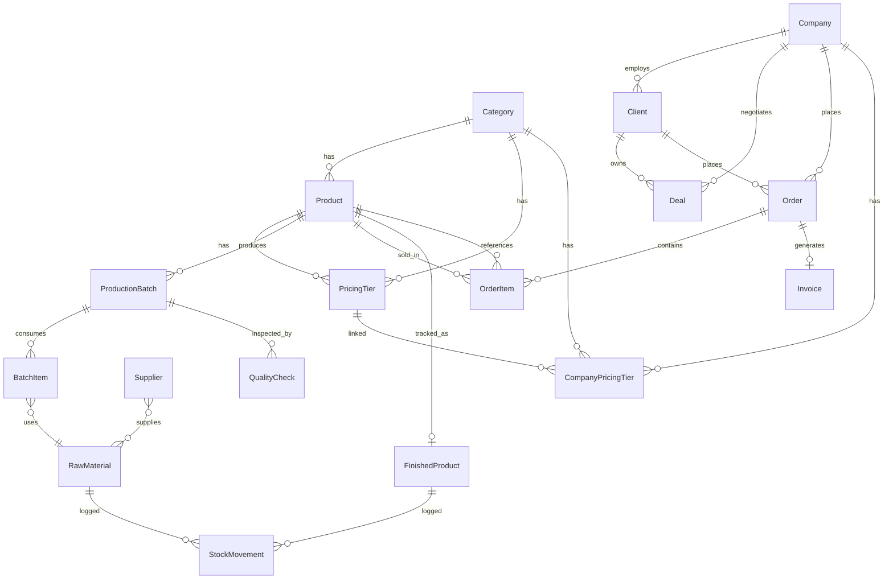

# 🧠 SAFCHA DASHBOARD — COMPLETE PROJECT CONTEXT

> **⚠️ MANDATORY: This file MUST be updated every time you add, modify, or delete anything in this project. Keep it in sync.**
> Read this file FIRST before making any changes. It is the single source of truth.

---

## 1. PROJECT OVERVIEW

**Safcha** is a Saudi-based premium saffron company. This dashboard is a **full-stack internal ERP** for managing the entire business: products, CRM, sales, inventory, production, finance, and more.

| Item | Value |
|------|-------|
| **Framework** | Next.js 16 (App Router, Turbopack) |
| **Language** | TypeScript |
| **Database** | PostgreSQL (Supabase-hosted) |
| **ORM** | Prisma 5 |
| **State** | Zustand (per-module stores) |
| **UI Library** | shadcn/ui (Radix primitives) |
| **Styling** | CSS Variables (dark/light themes via `data-theme`) |
| **i18n** | Custom `lib/i18n.ts` (English + Arabic + RTL) |
| **PDF** | jsPDF + jspdf-autotable |
| **Charts** | Recharts (planned Phase 9) |

### Design System
- **Sidebar**: Dark navy `#1A1A2E`, gold accent `#C9A84C`
- **Cards**: `var(--card)` with `var(--border)`
- **Primary**: `var(--primary)` (gold)
- **Theme**: Toggle via `data-theme="light"` / `"dark"` on `<html>`
- **RTL**: Toggle via `dir="rtl"` on `<html>`, managed by `useTranslation()` hook

---

## 2. FOLDER STRUCTURE

```
safcha-dashboard/
├── app/                          # Next.js App Router pages
│   ├── layout.tsx                # Root layout (Sidebar + Header + theme)
│   ├── page.tsx                  # CEO Overview dashboard
│   ├── globals.css               # CSS variables + theme definitions
│   ├── actions/                  # Server Actions (all data mutations)
│   │   ├── product/actions.ts    # Product CRUD
│   │   ├── pricing.ts            # Pricing Tier CRUD
│   │   ├── suppliers.ts          # Supplier CRUD + toggle active
│   │   ├── production.ts         # Batches, QC, R&D, SystemSettings
│   │   ├── sales/
│   │   │   ├── orders.ts         # getOrders, createOrder
│   │   │   ├── update-order-status.ts  # Phase 6: Status transitions + inventory
│   │   │   ├── invoices.ts       # createInvoice, getInvoices
│   │   │   └── utils.ts          # generateOrderNumber, generateInvoiceNumber
│   │   ├── inventory/
│   │   │   ├── raw-materials.ts  # getRawMaterials, createRawMaterial
│   │   │   ├── finished-products.ts  # getFinishedProducts, createFinishedProduct
│   │   │   └── stock-movements.ts    # getStockMovements, logMovement
│   │   └── crm/
│   │       ├── contacts.ts       # Client CRUD
│   │       ├── companies.ts      # Company CRUD (with CompanyPricingTier)
│   │       └── deals.ts          # Deal CRUD + stage updates
│   ├── products/                 # Product Catalog module
│   │   ├── page.tsx              # Products DataTable
│   │   ├── [id]/page.tsx         # Product Detail page
│   │   ├── pricing/page.tsx      # Pricing Tiers page
│   │   └── suppliers/            # Suppliers page
│   ├── crm/                      # CRM module
│   │   ├── contacts/             # Contacts DataTable + Drawer
│   │   ├── companies/            # Companies DataTable + Drawer
│   │   └── pipeline/             # Deals Kanban board
│   ├── sales/                    # Sales & Orders module
│   │   └── orders/
│   │       ├── page.tsx          # Orders DataTable
│   │       └── new/page.tsx      # New Order form (full page)
│   ├── inventory/                # Inventory module
│   │   ├── raw-materials/        # Raw Materials DataTable
│   │   └── finished/             # Finished Products DataTable
│   ├── production/               # Production module
│   │   ├── batches/page.tsx      # Production Batches DataTable + Modals
│   │   ├── quality/              # QC Checklist form + History
│   │   └── rnd/                  # R&D Projects
│   ├── finance/                  # Finance (placeholder)
│   ├── marketing/                # Marketing (placeholder)
│   ├── events/                   # Events (placeholder)
│   ├── tasks/                    # Team & Tasks (placeholder)
│   ├── documents/                # Document Vault (placeholder)
│   ├── strategy/                 # Strategy (placeholder)
│   └── settings/                 # System Settings
├── components/
│   ├── layout/
│   │   ├── Sidebar.tsx           # Dark sidebar navigation (EN + AR)
│   │   └── Header.tsx            # Top header (search, theme, language, avatar)
│   ├── ui/                       # shadcn/ui components (23 files)
│   ├── sales/
│   │   ├── OrderDetailDrawer.tsx # Order detail slide-in + status dropdown + invoice PDF
│   │   └── OrderStatusBadge.tsx  # Color-coded status badge
│   ├── products/                 # Product modals and components
│   ├── inventory/
│   │   ├── NewMaterialModal.tsx  # Add raw material form
│   │   ├── NewFinishedProductModal.tsx  # Add finished product form
│   │   └── LogMovementModal.tsx  # Universal stock adjustment modal
│   └── production/
│       └── QualityCheckForm.tsx  # 5-step QC checklist form
├── stores/                       # Zustand state stores
│   ├── appStore.ts               # Theme, language, RTL, sidebar state
│   ├── productStore.ts           # Product list + modal state
│   ├── crmStore.ts               # CRM contacts, companies, deals state
│   ├── salesStore.ts             # Orders + drawer state
│   ├── inventoryStore.ts         # Raw materials state
│   └── productionStore.ts        # Batches + batch modal state
├── lib/
│   ├── prisma.ts                 # Prisma client singleton
│   └── i18n.ts                   # Translation hook (EN/AR)
├── prisma/
│   └── schema.prisma             # Database schema (530 lines)
├── docs/
│   ├── PLAN-master-roadmap-detailed.md  # Phase-by-phase build plan
│   └── PROJECT_CONTEXT.md        # THIS FILE
└── .env                          # DATABASE_URL (Supabase PostgreSQL)
```

---

## 3. DATABASE SCHEMA (Entity Relationship)



### All Models (20 tables)

| Model | Table Name | Key Fields | Relations |
|-------|-----------|------------|-----------|
| **Category** | categories | name, description | → Products, PricingTiers |
| **Product** | products | name, skuPrefix, baseCost, baseRetailPrice, sfdaStatus, status | → Category, PricingTiers, OrderItems, ProductionBatches, FinishedProduct |
| **PricingTier** | pricing_tiers | tierName, minOrderKg, maxOrderKg, pricePerKg, discountPercent, marginPercent, isGlobal | → Product, Category, CompanyPricingTiers |
| **CompanyPricingTier** | company_pricing_tiers | companyId, categoryId, pricingTierId | → Company, Category, PricingTier (unique per company+category) |
| **Supplier** | suppliers | name, contactPerson, email, phone, isActive | standalone |
| **ProductionBatch** | production_batches | batchNumber, targetQty, actualQty, yieldPercent, status, qualityScore | → Product, BatchItems, QualityChecks |
| **BatchItem** | batch_items | materialName, quantityUsed, rawMaterialId | → ProductionBatch, (optional RawMaterial) |
| **QualityCheck** | quality_checks | visualInspection, weightVerification, tasteTest, labAnalysis, sfdaCompliance, overallScore, passed | → ProductionBatch |
| **RndProject** | rnd_projects | name, category, status, formulationDetails, costEstimate | standalone |
| **SystemSettings** | system_settings | productionCapacityKg | singleton |
| **Company** | companies | name, industry, city, lifetimeValue | → Clients, Deals, Orders, CompanyPricingTiers |
| **Client** | clients | name, email, phone, type, source, tags, city | → Company, Deals, Orders |
| **Deal** | deals | title, value, stage, priority, expectedCloseDate | → Company, Client |
| **Order** | orders | orderNumber, channel, status, paymentStatus, fulfillmentStatus, subTotal, vat, grandTotal | → Client, Company, OrderItems, Invoice |
| **OrderItem** | order_items | productId, quantity, unitPrice, discount, total | → Order, Product |
| **Invoice** | invoices | invoiceNumber, issueDate, dueDate, totalAmount, status | → Order (1:1) |
| **RawMaterial** | raw_materials | name, sku, category, currentStock, unitCost, reorderThreshold, location | → StockMovements |
| **FinishedProduct** | finished_products | productId, variant, sku, currentStock, reservedStock, unitCost, retailPrice, location | → Product (1:1), StockMovements |
| **StockMovement** | stock_movements | movementId, type, quantity, reason, referenceId | → RawMaterial or FinishedProduct |

### Key Enums

| Enum | Values |
|------|--------|
| ProductStatus | active, in_development, discontinued |
| SfdaStatus | approved, pending, not_submitted |
| BatchStatus | planned, in_progress, quality_check, completed, failed |
| RndStatus | ideation, formulation, testing, sfda_submission, approved, archived |
| ClientType | client, lead, supplier, partner, investor, other |
| LeadSource | website, event, referral, cold_outreach, social_media, manual_import |
| DealStage | new_lead, qualified, sample_sent, proposal, negotiation, closed_won, closed_lost |
| OrderChannel | b2b, b2c, pos, event, export, other |
| OrderStatus | draft, confirmed, processing, shipped, delivered, cancelled |
| PaymentStatus | pending, paid, partially_paid, overdue |
| FulfillmentStatus | unfulfilled, partially_fulfilled, fulfilled |
| StockMovementType | STOCK_IN, STOCK_OUT, ADJUSTMENT, TRANSFER, RETURN |
| StockMovementReason | PURCHASE, PRODUCTION_INPUT, ORDER_FULFILLMENT, DAMAGE, SAMPLE, EVENT |
| MaterialCategory | BASE_POWDER, FLAVORING, PACKAGING, OTHER |
| InventoryLocation | AL_AHSA_WAREHOUSE, KHOBAR_OFFICE |
| InvoiceStatus | draft, sent, paid, void |

---

## 4. AUTOMATION FLOWS (Cross-Module Logic)

These are the key automations that connect different modules together:

### 4.1 Order Status → Inventory (Phase 6)
**File:** `app/actions/sales/update-order-status.ts`

| Status Change | Inventory Side-Effect |
|---------------|----------------------|
| `draft → confirmed` | `FinishedProduct.reservedStock += OrderItem.quantity` (for each item) |
| `confirmed → processing` | No stock change |
| `processing → shipped` | `reservedStock -= qty`, `currentStock -= qty`, + `StockMovement(STOCK_OUT, ORDER_FULFILLMENT)` |
| `shipped → delivered` | No stock change (already deducted) |
| `any → cancelled` | If was confirmed/processing: `reservedStock -= qty` (rollback) |

**Valid Transitions:**
```
draft → confirmed | cancelled
confirmed → processing | cancelled
processing → shipped | cancelled
shipped → delivered
delivered → (terminal)
cancelled → (terminal)
```

### 4.2 QC Pass → Inventory (Phase 7)
**File:** `app/actions/production.ts` → `createQualityCheck()`

When QC **passes** (all 4 required steps = pass):
1. Batch status → `completed`
2. `FinishedProduct.currentStock += batch.actualQty` + `StockMovement(STOCK_IN)`
3. For each `BatchItem`: `RawMaterial.currentStock -= quantityUsed` + `StockMovement(STOCK_OUT, PRODUCTION_INPUT)`

When QC **fails**: Batch status → `failed`, no inventory change.

### 4.3 Stock Movement Logger
**File:** `app/actions/inventory/stock-movements.ts` → `logMovement()`

Manual stock adjustments using `prisma.$transaction`:
1. Creates `StockMovement` record
2. Updates `RawMaterial.currentStock` or `FinishedProduct.currentStock` atomically

---

## 5. UI PATTERNS & CONVENTIONS

### Naming Conventions
- **Server Actions**: `app/actions/<module>/<entity>.ts` → exported async functions with `'use server'`
- **Pages**: `app/<module>/<sub>/page.tsx` → Server component fetching initial data
- **Client Components**: Same folder as page → `<Name>Client.tsx`
- **Modals**: `components/<module>/<Modal>.tsx`
- **Stores**: `stores/<module>Store.ts`

### Common UI Patterns
1. **DataTable**: Server component fetches → passes to Client component → Zustand store → table render
2. **Modals**: Dialog from shadcn/ui, trigger = Button, form inside, calls server action, revalidates on success
3. **Drawers**: Sheet from shadcn/ui, slides from right (or left in RTL)
4. **Badges**: Color-coded status indicators (green=active, red=fail, amber=warning)
5. **Decimal Handling**: All Prisma Decimal fields converted to `Number()` in server actions before sending to client
6. **Auto IDs**: Pattern `PREFIX-YYYY-XXXX` (e.g. `ORD-2026-0001`, `SM-2026-0003`)
7. **Transactions**: All multi-table mutations use `prisma.$transaction()` for atomicity

### Sidebar Navigation Structure
```
Overview
Sales & Orders → Orders, Clients
Inventory → Raw Materials, Finished Products
Production → Batches, Quality Control, R&D
Products → Catalog, Categories, Pricing Tiers, Suppliers
Finance
CRM → Contacts, Companies, Pipeline
Marketing
Events
Team & Tasks
Documents
Strategy
Settings
```

---

## 6. PHASE STATUS & ROADMAP

| Phase | Name | Status |
|-------|------|--------|
| 1 | Foundation (Next.js, Prisma, Sidebar, Header) | ✅ Complete |
| 2 | Product Catalog (CRUD, Categories, Pricing) | ✅ Complete |
| 3 | CRM (Companies, Contacts, Deals Pipeline Kanban) | ✅ Complete |
| 4 | Sales & Orders (Orders, Line Items, Invoicing PDF) | ✅ Complete |
| 5 | Inventory Core (Raw Materials, Finished Products, Stock Movements) | ✅ Complete |
| 6 | Inventory + Orders Automation (Reserve, Ship, Cancel) | ✅ Complete |
| 7 | Production Completion (BatchItems, QC Form, Auto-Inventory) | ✅ Complete |
| 8 | Finance API (Transactions, Expenses, P&L) | ⏳ Pending |
| 9 | CEO Dashboard (KPIs, Charts, Activity Feed) | ⏳ Pending |
| 10 | Extra Modules (Marketing, Events, Tasks, Documents) | ⏳ Pending |

### Phase 8: Finance API (NEXT)
- Add `Transaction` + `Expense` models to Prisma
- When order status → `delivered`, auto-create Revenue Transaction
- `/finance/expenses` DataTable + `NewExpenseModal`
- P&L Dashboard = Total Revenue - Total Expenses

### Phase 9: CEO Dashboard
- Wire KPI cards: Total Revenue, Gross Margin, Inventory Value
- Recharts: Revenue Trend line chart, Sales by Channel donut
- Activity Feed: latest 20 actions from Orders + Movements + Batches

### Phase 10: Extra Modules
- Marketing: Campaign tracking, Ad Budget
- Events: Event Planning, Booth Inventory, Lead capture
- Team & Tasks: Kanban task board, employee directory
- Document Vault: Supabase Storage upload + categorization

---

## 7. DEVELOPMENT COMMANDS

```bash
# Start dev server
npm run dev

# Prisma schema push (after schema changes)
npx prisma db push

# Regenerate Prisma client (after schema changes)
npx prisma generate

# View database GUI
npx prisma studio


```

---

## 8. CRITICAL RULES FOR AI AGENTS

> **⚠️ READ BEFORE DOING ANYTHING:**

1. **Always read this file first** when picking up work on this project.
2. **Update this file** after every change — new models, new pages, new automations.
3. **Use `prisma.$transaction()`** for any multi-table writes (never separate writes).
4. **Convert Decimal to Number** in server actions before returning to client.
5. **Auto-generate IDs** using the `PREFIX-YYYY-XXXX` pattern.
6. **Revalidate paths** after mutations: `revalidatePath('/module/path')`.
7. **Follow the folder convention**: actions in `app/actions/`, modals in `components/`, stores in `stores/`.
8. **Use `'use server'`** directive in all action files. Every exported function must be `async`.
9. **Keep Sidebar updated** in both EN and AR when adding new navigation items.
10. **Test in browser** before marking anything as complete.

---

*Last updated: 2026-02-21 — After Phase 7 completion*
