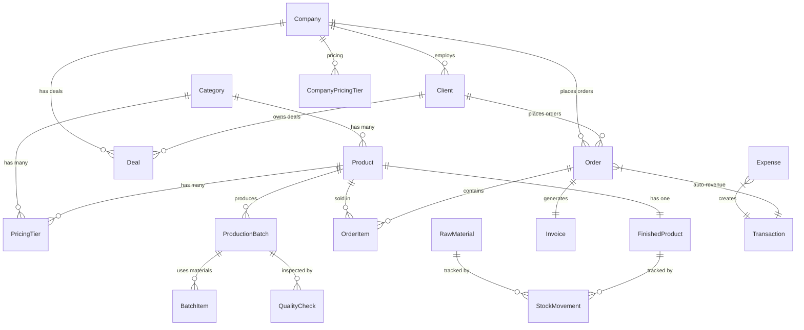

# SAFCHA Internal Dashboard — VIVA (Phase 1–9)

> Prepared for: **Aziz (CEO & Founder)**
> Prepared by: Ameen (Developer)
> Date: February 22, 2026
> Status: Phases 1–9 Complete | Phase 10 (Extra Modules) Pending

---

## 1. Project Overview

### Kya hai ye project?
Safcha Dashboard ek **centralized internal business management platform** hai jo Notion, Excel, Zoho aur scattered PDFs ko replace karta hai. Sab kuch ek jagah — Sales, Inventory, Production, Finance, CRM sab ek platform pe.

### Tech Stack
| Layer | Technology |
|-------|-----------|
| Framework | **Next.js 16** (App Router, Server Components) |
| Language | **TypeScript** |
| Database | **PostgreSQL** (via Supabase) |
| ORM | **Prisma** (type-safe, migrations) |
| State | **Zustand** (lightweight client store) |
| UI | **shadcn/ui** + Vanilla CSS variables |
| Charts | **Recharts** (line, pie, donut charts) |
| Hosting | Local dev (ready for Vercel) |

---

## 2. Business Flow — Pura Process Kaise Chalta Hai?

> **Ye sabse important section hai.** Yahan explain hota hai ki business start se end tak kaise chalta hai system me.

```
📁 CATEGORY banao (Powder, Dates, Spices, etc.)
    ↓
☕ PRODUCT banao (Category ke under — name, SKU, SFDA, cost, price)
    ↓
💰 PRICING TIERS set karo (Retail, Wholesale, Distributor, OEM, Strategic Partner)
    ↓
📦 RAW MATERIALS add karo (ingredients — powder, flavoring, packaging)
    ↓
🏭 PRODUCTION BATCH banao (select product → target qty → assign raw materials)
    ↓
✅ QUALITY CHECK karo (Visual + Weight + Taste + Lab + SFDA Compliance)
    ↓
  Pass ✅ → FINISHED PRODUCT stock automatically ↑ (inventory me add)
  Fail ❌ → Batch rejected, no inventory change
    ↓
👤 CRM: Company/Contact/Deal banao → Pipeline me move karo
    ↓
🛒 ORDER banao (select client → select products → auto pricing from tier)
    ↓
📋 Order Confirmed → Stock RESERVED + Invoice auto-generated
    ↓
🚚 Order Shipped → Stock DEDUCTED + Movement records created
    ↓
✅ Order Delivered → REVENUE Transaction auto-created!
    ↓
💵 FINANCE: P&L Dashboard shows Revenue - Expenses = Profit
    ↓
📊 CEO DASHBOARD: Real-time KPIs, Charts, Activity Feed — sab yahan dikhta hai
```

### Summary Diagram:

```
Category → Product → Pricing → Raw Materials → Production → QC →
  → Finished Product → Order → Ship → Deliver → Revenue → Dashboard
```

---

## 2.1 Aksar Puche Jane Wale Sawaal (FAQ)

### ❓ Pipeline me deal "Closed Won" ya "Closed Lost" hone k bad kya hoga?
**Jawab:** Deal pipeline me hi rehti hai — ye archive/history ki tarah kaam karti hai:
- **Closed Won** ✅ = Deal jeet gaye! Ab agle step me iss company/client ke liye **Order create** karo. Deal ka record rehta hai taaki pata chale ki konse company ko kitne deals convert hue.
- **Closed Lost** ❌ = Deal nahi mili. Record rehta hai taaki future me analysis ho sake — kon se stage pe lose hue, pattern kya hai.
- Dono closed hone ke baad pipeline KPIs me count nahi hoti (Overview me sirf **active** deals dikhti hain).
- **Suggestion:** Future me "Archive" button add ho sakta hai jo purani deals hide kare.

### ❓ "Log Stock" button kya karta hai? (Inventory)
**Jawab:** "Log Stock" ka matlab hai **manually stock adjust karna**. Ye tab use hota hai jab:

| Button press karo → Ye hota hai |
|------|
| **STOCK IN** = Naya maal aaya (purchase, return) → Stock badhta hai |
| **STOCK OUT** = Maal gaya (damage, sample, event) → Stock ghatta hai |
| **ADJUSTMENT** = Counting me farq → Manual correction |
| **TRANSFER** = Ek warehouse se doosre me → Location change |

Jab order confirmed/shipped hota hai toh stock **automatically** deduct hota hai — Log Stock manual work ke liye hai (jaise supplier se naya maal aaya, ya kuch damage ho gaya).

Har Log Stock entry se ek **Stock Movement** record banta hai (SM-YYYY-XXXX) jo audit trail ka kaam karta hai — pata chalta hai kab, kitna, kyu stock badla.

### ❓ Order "Processing" ke baad aage kaise badhega?
**Jawab:** Order ka pura flow ye hai — **har step admin manually karta hai** Order Detail drawer se:

```
1. DRAFT (naya order bana, abhi submit nahi hua)
    ↓ [Status dropdown → Confirmed karo]
2. CONFIRMED (stock reserved, invoice auto-create)
    ↓ [Status dropdown → Processing karo]
3. PROCESSING (team order prepare kar rahi hai)
    ↓ [Status dropdown → Shipped karo]
4. SHIPPED (maal dispatch ho gaya → stock automatically deduct + movement logged)
    ↓ [Status dropdown → Delivered karo]
5. DELIVERED (customer ko mila → REVENUE automatically finance me add ✅)
```

**Kaise karein:** Sales → Orders → Kisi order pe click → **Order Detail Drawer** khulega → Status dropdown se next stage select karo → "Update" button → Done!

- Har status change pe automated actions hoti hain (stock reserve/deduct, invoice, revenue)
- "Cancelled" kisi bhi stage se kar sakte ho → stock wapas release ho jayega

---

## 2.2 Production Readiness — Kya Kami Hai?

> **Ye important hai boss ko btane ke liye:** Dashboard abhi functional hai, lekin production (real daily use) me lane ke liye ye cheezein chahiye:

### 🔴 Critical (Must Have)
| # | Item | Why | Status |
|---|------|-----|--------|
| 1 | **User Login / Authentication** | Bina login ke koi bhi access kar sakta hai, security risk | ❌ Not Built |
| 2 | **Role-Based Access (RBAC)** | CEO sab dekhe, Sales team sirf orders, Production sirf batches — permissions chahiye | ❌ Not Built |
| 3 | **Data Backup / Export** | CSV/PDF export for records, regular DB backup | ❌ Not Built |

### 🟡 Important (Should Have)
| # | Item | Why | Status |
|---|------|-----|--------|
| 4 | **Invoice PDF Generation** | Record banta hai lekin actual downloadable PDF nahi | ❌ Not Built |
| 5 | **Email Notifications** | Order status change pe client/team ko email | ❌ Not Built |
| 6 | **Print Labels** | Production batches ke liye labels/barcodes | ❌ Not Built |
| 7 | **Audit Log** | Kon user ne kab kya change kiya — full trail | ❌ Not Built |

### 🟢 Nice to Have (Can Add Later)
| # | Item | Why | Status |
|---|------|-----|--------|
| 8 | **Mobile Responsive** | Phone/tablet pe clean view (abhi desktop-first hai) | Partial |
| 9 | **Drag & Drop Pipeline** | Deals ko drag karke stage change karna | ❌ Not Built |
| 10 | **Document Vault** | Contracts, certificates, PDFs upload + manage | ❌ Not Built |
| 11 | **Calendar / Events** | Expos, marketing events, deadlines | ❌ Not Built |
| 12 | **Team Tasks (Kanban)** | Task assignment, deadlines, progress tracking | ❌ Not Built |

### ✅ Jo Working Hai (Ready)
| Feature | Status |
|---------|--------|
| Full Product Catalog + Pricing | ✅ |
| Complete CRM (Companies, Contacts, Pipeline) | ✅ |
| Order-to-Cash full automation | ✅ |
| Production → Inventory automation | ✅ |
| Finance P&L + Expenses | ✅ |
| CEO Dashboard with real KPIs | ✅ |
| Module Overview pages (Sales, Inventory, CRM, Production, Finance) | ✅ |
| Bilingual (EN + Arabic) | ✅ |
| Dark/Light Theme | ✅ |

### Bottom Line:
**Phase 1-9 ka 90% kaam done hai.** Production me lane ke liye **sirf Login + Roles** chahiye (2-3 din ka kaam). Baaki features (PDF, Email, etc.) iterative add ho sakte hain — system abhi bhi **fully usable** hai single admin ke liye.

---

## 3. Project Flow — Kaise Start Hota Hai?

```
User opens dashboard
    ↓
app/layout.tsx loads → Sidebar + Header + Theme
    ↓
app/page.tsx → CEO Dashboard (server component)
    ↓
Calls getDashboardData() → Prisma queries → PostgreSQL
    ↓
Returns KPIs, Charts, Activity Feed → DashboardClient renders
```

### Architecture Pattern

```
┌────────────────────────────────────────────────────────┐
│                     BROWSER (Client)                    │
│  ┌──────────┐  ┌───────────────┐  ┌──────────────────┐ │
│  │  Sidebar  │  │  Page Content  │  │  Modals/Drawers  │ │
│  │ (Zustand) │  │ (Server Comp)  │  │ (Client Comp)    │ │
│  └──────────┘  └───────┬───────┘  └──────────────────┘ │
└────────────────────────┼───────────────────────────────┘
                         │ Server Actions
┌────────────────────────┼───────────────────────────────┐
│               SERVER (Next.js App Router)               │
│  ┌─────────────────────┼─────────────────────────────┐ │
│  │         app/actions/*.ts (Server Actions)          │ │
│  │    product/ | sales/ | inventory/ | production/   │ │
│  │    crm/ | finance/ | dashboard.ts                 │ │
│  └─────────────────────┼─────────────────────────────┘ │
└────────────────────────┼───────────────────────────────┘
                         │ Prisma ORM
┌────────────────────────┼───────────────────────────────┐
│              DATABASE (PostgreSQL / Supabase)           │
│   20+ tables, 10+ enums, full relational integrity     │
└────────────────────────────────────────────────────────┘
```

---

## 4. Database Schema — Kon Kisse Juda Hai (Relations)

### Entity Relationship Diagram



### Sab Tables Ka Summary

| Model | Table Name | Records | Key Relations |
|-------|-----------|---------|---------------|
| **Category** | categories | Product categories | → Products, PricingTiers |
| **Product** | products | Product catalog | → Category, Variants, OrderItems, Batches |
| **PricingTier** | pricing_tiers | Wholesale pricing | → Product, Category, Companies |
| **CompanyPricingTier** | company_pricing_tiers | Per-company pricing | → Company ↔ Category ↔ Tier |
| **Supplier** | suppliers | Material suppliers | Standalone (name, contact, phone) |
| **ProductionBatch** | production_batches | Manufacturing batches | → Product, BatchItems, QualityChecks |
| **BatchItem** | batch_items | Raw materials used per batch | → ProductionBatch |
| **QualityCheck** | quality_checks | QC inspections | → ProductionBatch |
| **RndProject** | rnd_projects | R&D experiments | Standalone |
| **Company** | companies | B2B clients | → Clients, Deals, Orders, Pricing |
| **Client** | clients | Individual contacts | → Company, Deals, Orders |
| **Deal** | deals | Sales pipeline | → Company, Client |
| **Order** | orders | Sales orders | → Client, Company, OrderItems, Invoice |
| **OrderItem** | order_items | Line items | → Order, Product |
| **Invoice** | invoices | Invoice records | → Order (1:1) |
| **RawMaterial** | raw_materials | Raw ingredient stock | → StockMovements |
| **FinishedProduct** | finished_products | Ready-to-sell stock | → Product, StockMovements |
| **StockMovement** | stock_movements | Audit trail | → RawMaterial OR FinishedProduct |
| **Transaction** | transactions | Revenue + Expense ledger | referenceId → Order/Expense |
| **Expense** | expenses | Business expenses | → Transaction (linked) |
| **SystemSettings** | system_settings | Config | Standalone |

---

## 5. Phase-by-Phase Breakdown

### Phase 1: Foundation & Setup ✅
**Kya hua:**
- Next.js 16 project setup with App Router
- Prisma + PostgreSQL (Supabase) connected
- Design system: CSS variables for dark/light themes
- Sidebar with collapsible sections (EN + Arabic)
- Header with search, theme toggle, language toggle
- Zustand store for global state (language, sidebar state)
- shadcn/ui component library integrated

**Key Files:**
- `app/layout.tsx` — Root layout
- `components/layout/Sidebar.tsx` — Navigation (EN + AR)
- `components/layout/Header.tsx` — Search + toggles
- `app/globals.css` — Theme variables
- `stores/appStore.ts` — Zustand store

---

### Phase 2: Product Catalog ✅
**Kya hua:**
- Product CRUD (create, edit, delete)
- Product detail modal with all fields (name, SKU, category, SFDA, pricing)
- Product variants system
- Pricing Tiers per product (5 tiers: Retail → Strategic Partner)
- Multi-category pricing for B2B companies

**Automation:**
```
Product Created → SKU auto-generated
Company assigned → CompanyPricingTier links tier per category
```

**Key Relations:**
- Product → Category (many:1)
- Product → PricingTier (1:many)
- Company → CompanyPricingTier → PricingTier (per category)

---

### Phase 3: CRM ✅
**Kya hua:**
- **Companies**: CRUD + industry/city/website/lifetime value
- **Contacts**: CRUD with company link, type (client/lead/supplier), source, tags
- **Deals Pipeline**: Kanban board with 7 stages (New Lead → Closed Won/Lost)
- Company filter on Contacts page
- Cross-navigation (Company → its Contacts)

**Pipeline Flow:**
```
New Lead → Qualified → Sample Sent → Proposal → Negotiation → Closed Won ✅
                                                              → Closed Lost ❌
```

**Key Relations:**
- Client → Company (many:1)
- Deal → Company + Client
- Company → Orders (for lifetime value)

---

### Phase 4: Sales & Orders ✅
**Kya hua:**
- **Orders List**: DataTable with filters (status, channel, payment)
- **New Order Form**: Multi-step — select client → add products → auto-calculate pricing
- **Order Detail Drawer**: Full breakdown (line items, subtotal, VAT 15%, shipping, grand total)
- **Invoice Generation**: Auto-created on order confirmation
- **Status Workflow**: Draft → Confirmed → Processing → Shipped → Delivered → Cancelled

**Automation (Order Status Changes):**
```
Draft → Confirmed:
  └→ Reserve finished product stock (reservedStock += qty)
  └→ Auto-generate Invoice (INV-YYYY-XXXX)

Confirmed → Shipped:
  └→ Deduct stock (currentStock -= qty, reservedStock -= qty)
  └→ Create STOCK_OUT movement records
  └→ Update fulfillment to "partially_fulfilled"

Shipped → Delivered:
  └→ AUTO-CREATE Transaction (type: revenue, amount: grandTotal) ← Phase 8!
  └→ Update fulfillment to "fulfilled"

Any → Cancelled:
  └→ Release reserved stock (reservedStock -= qty)
  └→ Void invoice
```

**Key Relations:**
- Order → Client + Company + OrderItems + Invoice
- OrderItem → Product (with pricing from tier)

---

### Phase 5: Inventory Core ✅
**Kya hua:**
- **Raw Materials**: CRUD with SKU (RM-001), category, stock levels, reorder threshold
- **Finished Products**: Linked to Product, with currentStock, reservedStock, availableStock
- **Stock Movements**: Full audit log (SM-YYYY-XXXX) with type, quantity, reason
- **Suppliers**: CRUD for material vendors
- Inline supplier creation from Raw Materials modal

**Stock Movement Types:**
| Type | When |
|------|------|
| STOCK_IN | Purchase, production output |
| STOCK_OUT | Order shipping, production input |
| ADJUSTMENT | Manual corrections |
| TRANSFER | Between locations |
| RETURN | Returned items |

**Key Relations:**
- RawMaterial → StockMovement (1:many)
- FinishedProduct → Product (1:1) + StockMovement (1:many)

---

### Phase 6: Inventory + Orders Automation ✅
**Kya hua:**
- Connected Phase 4 (Orders) ↔ Phase 5 (Inventory)
- Auto stock reservation on order confirmation
- Auto stock deduction on shipping
- Auto stock release on cancellation
- All operations use `prisma.$transaction` for atomicity (sab ek saath hota hai, kuch fail ho toh sab rollback)

**The Big Automation Chain:**
```
Order Confirmed → FinishedProduct.reservedStock ↑
Order Shipped   → FinishedProduct.currentStock ↓ + StockMovement created
Order Cancelled → FinishedProduct.reservedStock ↓ (released back)
Order Delivered → Transaction (revenue) created ← Phase 8
```

---

### Phase 7: Production + QC ✅
**Kya hua:**
- **Production Batches**: Create with target qty, link to product
- **Batch Items**: Track which raw materials were used and how much
- **Quality Control**: 5-point checklist (Visual, Weight, Taste, Lab, SFDA)
- QC Pass/Fail determines batch status
- **QC Pass → Auto-inventory update**:
  - Finished Product stock INCREASED
  - Raw Material stock DECREASED (based on BatchItems)
  - StockMovement records created for both

**Production → Inventory Flow:**
```
Batch Created (planned) → In Progress → Quality Check
    ↓
QC Passed ✅:
  └→ Batch status → "completed"
  └→ FinishedProduct.currentStock += actualQty
  └→ RawMaterial.currentStock -= quantityUsed (per BatchItem)
  └→ StockMovement (STOCK_IN for finished, STOCK_OUT for raw)

QC Failed ❌:
  └→ Batch status → "failed"
  └→ NO inventory changes
```

---

### Phase 8: Finance API ✅
**Kya hua:**
- **Transaction** model: unified ledger for revenue + expenses
- **Expense** model: categorized business expenses (9 categories)
- **Auto-Revenue**: When order → delivered, Transaction automatically created
- **Expense CRUD**: Create/Edit/Delete with linked Transaction
- **P&L Dashboard**: 4 KPI cards (Revenue, Expenses, Net Profit, Margin)
- Sidebar updated with Finance → Overview + Expenses

**Finance Flow:**
```
Order Delivered → auto Transaction (type: revenue, amount: grandTotal)
Expense Created → auto Transaction (type: expense, amount, linked)
Expense Deleted → auto Transaction deleted too

P&L Dashboard = SUM(revenue) - SUM(expenses)
```

---

### Phase 9: CEO Dashboard ✅
**Kya hua:**
- Replaced 100% hardcoded dashboard with real DB data
- **6 KPI Cards**: Revenue, Expenses, Net Profit, Orders, Inventory Value, Active Clients
- **Revenue vs Expenses Chart**: Recharts LineChart (6-month trend)
- **Sales by Channel Chart**: Recharts PieChart (b2b/b2c/event/export breakdown)
- **Quick Actions**: 4 clickable buttons (New Order, Add Stock, Add Client, Add Expense)
- **Live Activity Feed**: Last 20 events from Orders + StockMovements + ProductionBatches

---

## 6. Cross-Module Automation Workflows

### 5.1 Order-to-Cash Flow (Spec Section 5.1)
```
CRM: Lead Created
  → Deal Pipeline: Qualified → Sample → Proposal → Negotiation
    → Deal Closed Won
      → Order Created (Draft)
        → Confirmed: Stock Reserved + Invoice Generated
          → Shipped: Stock Deducted + Movements Logged
            → Delivered: Revenue Transaction Created ✅
```
**Status: ✅ FULLY IMPLEMENTED** (Phase 4 + 6 + 8)

### 5.2 Production-to-Inventory Flow (Spec Section 5.2)
```
Batch Planned → In Progress → QC Check
  → QC Pass: Finished Product Stock ↑, Raw Material Stock ↓
  → QC Fail: No inventory changes, batch marked failed
```
**Status: ✅ FULLY IMPLEMENTED** (Phase 7)

### 5.3 Event Lifecycle & Employee Onboarding
**Status: ⏳ Phase 10** — These are independent modules not yet built.

---

## 7. Audit Findings — Issues & Gaps

### ✅ Working Correctly
| Area | Status |
|------|--------|
| All Prisma relations | ✅ No broken foreign keys |
| Order status transitions | ✅ All 6 statuses handling correct |
| Stock reservation/deduction logic | ✅ Atomic via $transaction |
| QC → Inventory auto-update | ✅ Pass = stock in/out, Fail = no change |
| Revenue auto-creation on delivery | ✅ Transaction created in $transaction block |
| Expense ↔ Transaction sync | ✅ Create/Update/Delete linked |
| Dashboard KPIs from real data | ✅ Revenue, Expenses, Orders, Inventory, Clients |
| Bilingual (EN/AR) | ✅ Sidebar, headers, RTL support |
| Dark theme | ✅ CSS variables system |

### ⚠️ Minor Gaps (Not Blockers)
| Area | Gap | Impact | Status |
|------|-----|--------|--------|
| **Auth/RBAC** | No login system yet, all users see everything | Low (internal use, single admin currently) | Phase 10 |
| **Stock alerts** | Low stock badge display already wired ✅ | Fully working | ✅ Fixed |
| **Invoice PDF** | Invoice records exist but no actual PDF generation | Can integrate later | Deferred |
| ~~**Supplier ↔ RawMaterial FK**~~ | ~~`supplierId` was string, no FK~~ | ~~Now proper `@relation`~~ | ✅ Fixed |
| ~~**Expense VAT field**~~ | ~~Missing VAT field~~ | ~~Now added to schema + UI~~ | ✅ Fixed |
| ~~**Payment method**~~ | ~~Missing paymentMethod~~ | ~~Now added with enum~~ | ✅ Fixed |

### Items Deferred to Phase 10
| Feature | PDF Spec Section |
|---------|-----------------|
| Marketing campaigns | 4.8 |
| Events & Expos | 4.9 |
| Team & Tasks (Kanban) | 4.10 |
| Document Vault | 4.11 |
| Strategy & OKRs | 4.12 |
| Settings & Admin | 4.13 |
| User Authentication | 2.3 |

---

## 8. Files & Folder Structure

```
safcha-dashboard/
├── app/
│   ├── page.tsx                    ← CEO Dashboard (server)
│   ├── DashboardClient.tsx         ← KPIs + Charts + Feed
│   ├── layout.tsx                  ← Root layout
│   ├── globals.css                 ← Theme system
│   │
│   ├── actions/                    ← Server Actions (ALL mutations)
│   │   ├── dashboard.ts            ← KPI aggregation
│   │   ├── product/actions.ts      ← Product CRUD
│   │   ├── pricing.ts              ← Pricing Tier CRUD
│   │   ├── production.ts           ← Batch + QC actions
│   │   ├── sales/orders.ts         ← Order CRUD
│   │   ├── sales/update-order-status.ts ← Status automations
│   │   ├── sales/invoices.ts       ← Invoice generation
│   │   ├── inventory/raw-materials.ts
│   │   ├── inventory/finished-products.ts
│   │   ├── inventory/stock-movements.ts
│   │   ├── crm/companies.ts
│   │   ├── crm/contacts.ts
│   │   ├── crm/deals.ts
│   │   ├── finance/expenses.ts     ← Expense CRUD + P&L
│   │   └── globalSearch.ts
│   │
│   ├── sales/orders/               ← Orders list + new order form
│   ├── inventory/                  ← Raw Materials + Finished Products
│   ├── production/                 ← Batches + QC + R&D
│   ├── products/                   ← Catalog + Pricing + Suppliers
│   ├── crm/                        ← Companies + Contacts + Pipeline
│   ├── finance/                    ← P&L Dashboard + Expenses
│   └── settings/                   ← Placeholder
│
├── components/
│   ├── layout/Sidebar.tsx          ← Sidebar (EN + AR, collapsible)
│   ├── layout/Header.tsx           ← Global header
│   └── ui/                         ← shadcn components
│
├── stores/appStore.ts              ← Zustand global state
├── prisma/schema.prisma            ← 20+ models, 10+ enums
└── docs/                           ← PROJECT_CONTEXT, ROADMAP, this file
```

---

## 9. Count Summary

| Metric | Count |
|--------|-------|
| Database Models | 20 |
| Enums | 13 |
| Server Action Files | 17 |
| Page Routes | 24 |
| Client Components | 25+ |
| Sidebar Items | 13 groups |
| Automation Workflows | 6 |
| Languages | 2 (EN + AR) |
| Phases Complete | 9/10 |

---

## 10. Demo Flow (For Presentation)

### Recommended walkthrough order:

1. **Open Dashboard** → Show real KPIs, charts, activity feed
2. **CRM** → Create a Company → Add Contact → Create Deal in Pipeline (drag to stages)
3. **Products** → Show catalog → Pricing Tiers → Variants
4. **Inventory** → Show Raw Materials (add stock) → Finished Products (stock levels)
5. **New Order** → Select client → Add products → See auto-pricing → Submit
6. **Order Flow** → Change status: Confirmed (stock reserved) → Shipped (stock deducted) → Delivered (revenue created!)
7. **Finance** → Show P&L dashboard → Add an Expense → See values update
8. **Production** → Create Batch → Run QC → Pass → Stock auto-updates
9. **Dashboard** → Come back → Show all KPIs updated with real numbers

---

*Phase 10 (Marketing, Events, Tasks, Documents, Strategy, Settings) is next and can be planned when ready.*
